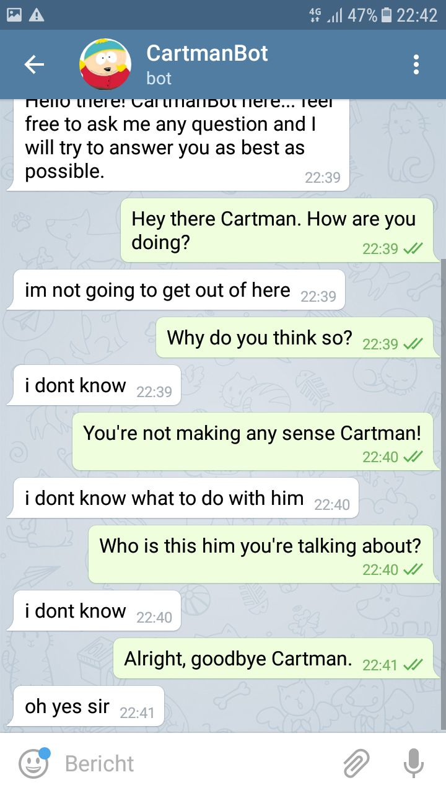
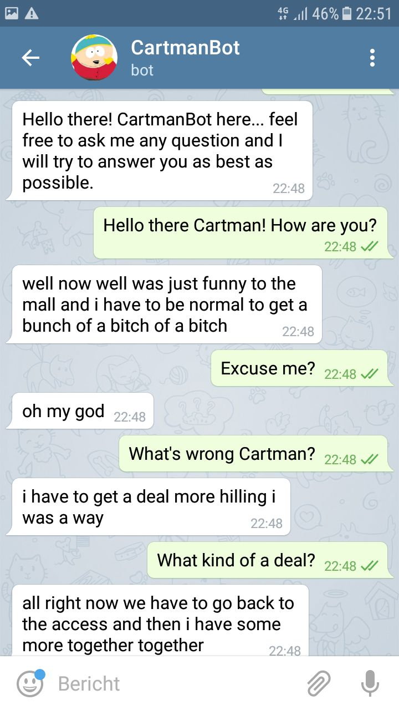
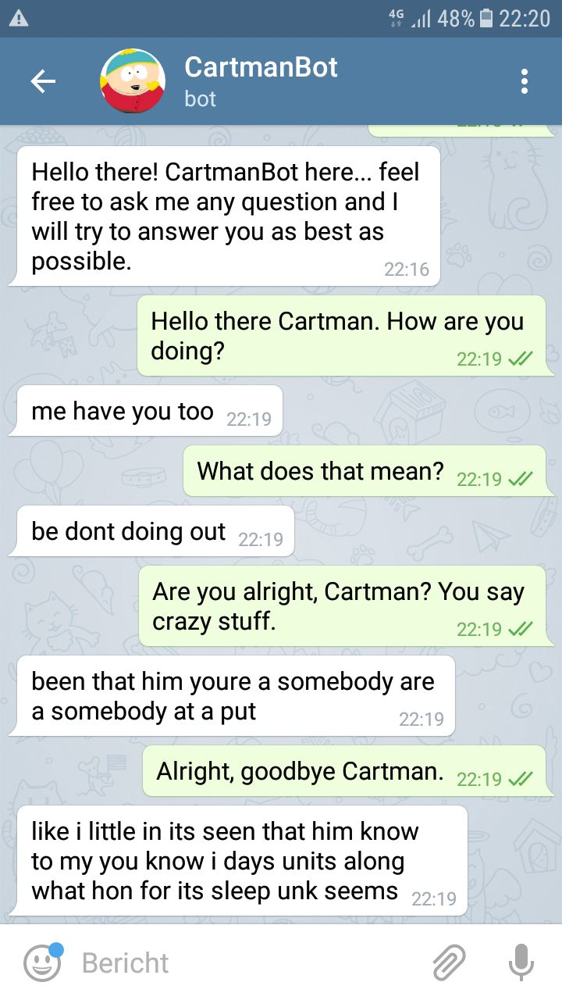

# Chatbot
Jordy Ripperda, 

Luuk Arts

This repository was created for an assignment of the course 'Cognitive Computational Modeling of Language and Web interaction' where we were instructed to create a chatbot. Our goal was to create a chatbot that could generate context appropriate replies based on user input and that would talk like Eric Cartman, a character from the TV-series South Park. Right now, it is capable of generating replies using the vocabulary of Eric Cartman. However, the replies are not always grammatical and the contents of the reply are often not very context appropriate

### Using our chatbot
In this repository, we included 3 notebooks, which we used to train our models. It also includes the CartmanBot folder, which contains all files necessary to run our chatbot, except the checkpoint files containing our pretrained models, which were too big for Github. If you want to run this bot, please contact us for those files.

To then run the bot, download the CartmanBot folder and run the file 'telegram.py' with python 3.

## Approach

### Datasets
We used two datasets to train our model. The first dataset is from Kaggle (https://www.kaggle.com/tovarischsukhov/southparklines/data) and contains South Park dialogues from the first 18 seasons. It contains the lines sorted by episode and character.

The other dataset is the Cornell Movie Dataset, linked in the assignment description. This dataset contains lines and conversations from a large variety of movies, including the South Park movie "South Park: Bigger, Longer & Uncut".

### Model (seq2seq)
The model we use is the sequence to sequence (seq2seq) model described in the paper "Sequence to Sequence Learning with Deep Neural Networks" by Ilya Sutskever, Oriol Vinyals, Quoc V. Le (http://papers.nips.cc/paper/5346-sequence-to-sequence-learning-with-neural-networks.pdf). 

The seq2seq model consists of 2 RNNs. The first network encodes the input sequence (i.e. the questions in our data), and constructs a context that is meant to represent the semantics of the input. The second network then decodes this context in order to generate an output sequence (i.e. the answers in our data).

Since it would take too much time to implement and debug this model ourselves, we decided to use a github repository. Initially we tried the repository mentioned in the lecture slides (https://github.com/farizrahman4u/seq2seq). However, we failed to get good results and the working example provided on their github page (https://github.com/nicolas-ivanov/debug_seq2seq) mentioned the following: "No good results were achieved with this architecture yet.".

So we decided to use the following repository instead: https://github.com/suriyadeepan/practical_seq2seq. This repository contains an implementation of seq2seq as well as some functions to preprocess our data such that it fits the model.

### Intelligent feature
When our model encounters an unknown (i.e. not in vocabulary) word in the user's input it will attempt to replace the unknown word by a synonym that does occur in the vocabulary. This way the chatbot is better capable of generating a reply that makes sense given the semantics of the input. For this the NLTK WordNet interface is used (http://www.nltk.org/howto/wordnet.html). For every unknown word, a list of synonyms is generated, and the first synonym that does occur in the vocabulary is used for replacement. 

### Training the model
We tried multiple methods of training the model.

* Training for 100.000 iterations on the Cornell dataset.
* First train for 20.000 iterations on the whole dataset, then for another 5.000 iterations on Cartman's lines and conversations.
* First train for 100.000 iterations on only the Cornell dataset, then another 10.000 iterations on Cartman's lines and conversations.

The reason for this is that simply training on Cartman's dialogue resulted in a small vocabulary and generally poor results. We decided to add additional data by first training on bigger datasets and then adding Cartman's personality by finishing the training with a subset of the South Park dataset containing only dialogues involving Cartman. 

## Results

### Cornell data only

### Cornell data + Cartman's lines

### Sout park data only (all characters)

We can see that the Cornell bot produces some well structured responses. However, the variation of the answers is quite limited and mostly involves "I don't", "You don't" and "don't know". This may have impacted further training on the South Park dataset as well. We think we could improve our bot by balancing out the dataset a little more, so that the chatbot gets a more balanced set of responses.

The cornell + cartman bot already produces more varying answers. However, the structure seems a bit incorrect and meaningless. This could be improved by further training of the model.

The bot that only used south park data seems even more meaningless. This is probably due too the size of the dataset, which is much smaller than the Cornell data set. 

We also tried training on Cartman's lines only but this performed even worse. Herefore we chose not to show the results here.

Finally, we have to note that South Park dialogue contains very few lines that are used in normal everyday conversation, which may make it poorly suited for a chatbot that has to respond to user input.
